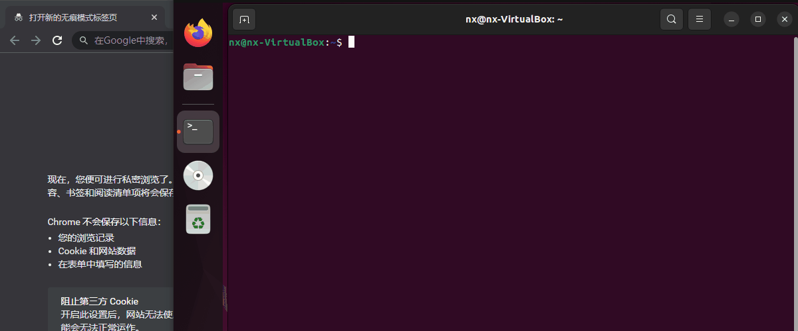
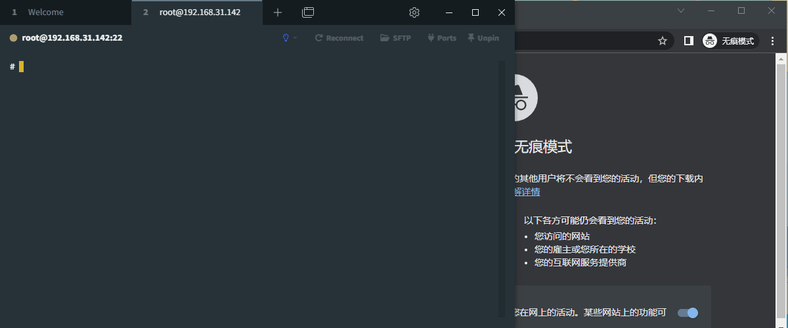

# WebTerminal demo with Golang and Xterm.js

## 简介 / Brief

这是一个 `WebTerminal` 的项目演示，使用 `Golang` 和 `Xterm.js` 实现。This is a demo for `WebTerminal`, based on `Golang` and `Xterm. js` .


## 用法 / Usage

下载可执行文件到服务器设备中，然后启动服务。Download the executable file to the server device, and then start the service.

```shell
chmod +x webterminal_xxxx
./webterminal_xxxx
```

在客户端浏览器中打开 `http://server_ip_address:22333/` 。Navigate your browser to `http://server_ip_address:22333/` .


## 演示 / Showcase

**linux_x86-64 （Ununtu 22.04 AMD Ryzen 5 PRO 4650U）：**




**linux_armv5 （NUC980 Linux buildroot 5.10.103+ armv5tejl GNU/Linux）：**




